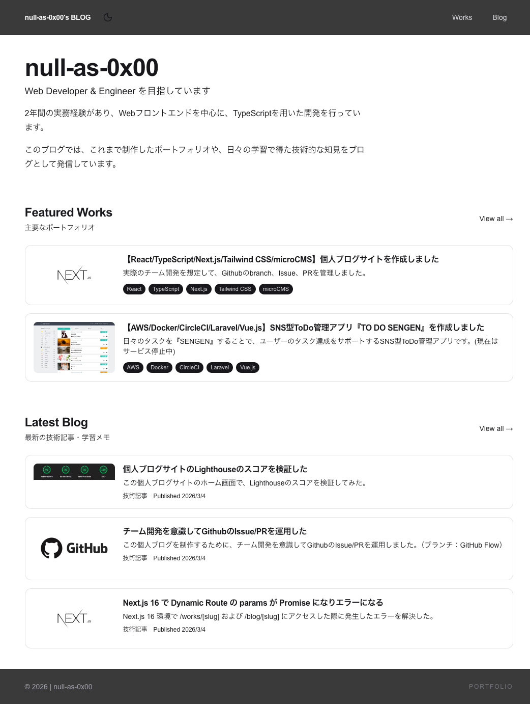
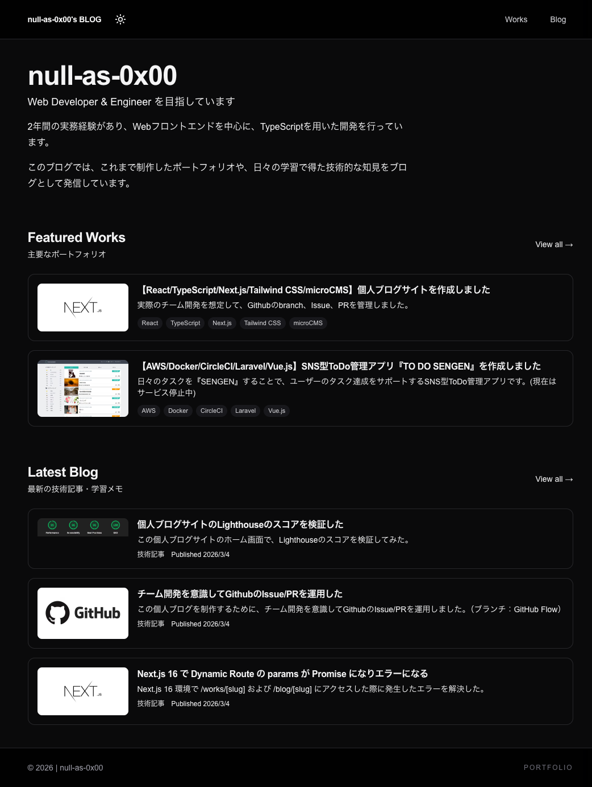

# 💻 null-as-0x00 Portfolio

[](https://nextjs.org/)
[](https://www.typescriptlang.org/)
[](https://tailwindcss.com/)
[](https://vercel.com/)

---

## ✨ Overview

URL: https://null-as-0x00-portfolio.vercel.app/

| ライトモード | ダークモード |
| :---: | :---: |
|  |  |


最新の **Next.js (App Router)** エコシステムをベースに、パフォーマンス、アクセシビリティ、そして直感的なUI/UXを追求して構築しました。

### Key Features
- **App Router Architecture**: Server Componentsを最大限活用し、初期読み込みの高速化とSEO最適化を実現。
- **Responsive Design**: モバイル、タブレット、デスクトップすべてのデバイスで一貫した体験を提供。
- **Fine-tuned Animations**: `Framer Motion` を使用した、煩わしくない滑らかなインタラクション。
- **High-Quality UI**: `shadcn/ui` (Radix UI) を基盤とした、アクセシビリティに配慮したコンポーネント設計。
- **Optimized SEO/OGP**: Next.js Metadata APIにより、SNSシェア時の見栄え（Open Graph）まで細かく制御。

---

## 🛠 Tech Stack

### Frontend
- **Framework**: [Next.js](https://nextjs.org/) (App Router)
- **Language**: [TypeScript](https://www.typescriptlang.org/)
- **Styling**: [Tailwind CSS](https://tailwindcss.com/)
- **Components**: [shadcn/ui](https://ui.shadcn.com/) (based on Radix UI)
- **Animation**: [Framer Motion](https://www.framer.com/motion/)
- **Icons**: [Lucide React](https://lucide.dev/)

### Tools & Infrastructure
- **Hosting**: [Vercel](https://vercel.com/)
- **Formatting**: ESLint / Prettier
- **Package Manager**: pnpm (Recommended) / npm / bun

---

## 📂 Project Structure

```text
src/
├── app/            # Next.js App Router (Routing, Pages, Layouts)
├── components/     # React Components
│   ├── ui/         # Atom level components (shadcn/ui)
│   └── shared/     # Domain specific or Common components
├── hooks/          # Custom React Hooks
├── lib/            # Utility functions (cn utility, constants, etc.)
├── public/         # Static assets (Images, Favicons, OGP Images)
└── types/          # Global TypeScript type definitions
```

---

## 🚀 Getting Started

### Prerequisites
- Node.js 18.x or later
- pnpm (Recommended)

### Installation & Development
```Bash
# Clone the repository
git clone [https://github.com/null-as-0x00/null-as-0x00-portfolio.git](https://github.com/null-as-0x00/null-as-0x00-portfolio.git)

# Install dependencies
pnpm install

# Start development server
pnpm dev
```
ブラウザで http://localhost:3000 を開き、ローカルでの動作を確認できます。

---

Developed by [@null-as-0x00](https://github.com/null-as-0x00)
